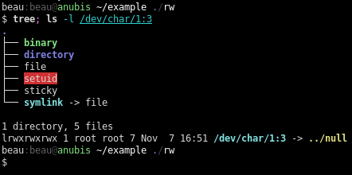

beau-theme
=========
[][license]

My custom theme.

## Installation

Clone this repository: `git clone https://github.com/hastinbe/beau-theme.git ~/beau-theme`

#### Xdefaults

`#include "~/beau-theme/Xdefaults/beau"`

#### Xresources

`#include "~/beau-theme/Xresources/beau"`

## License

`beau-theme` is released under [GNU General Public License v2][license]

Copyright (C) 1989, 1991 Free Software Foundation, Inc.

[license]: https://www.gnu.org/licenses/gpl-2.0.en.html
